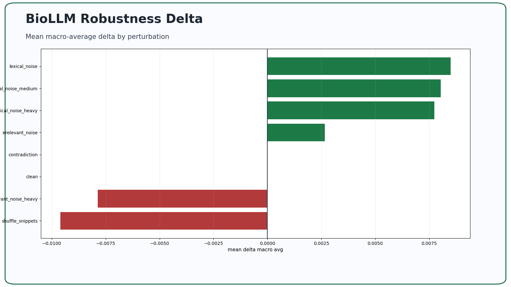
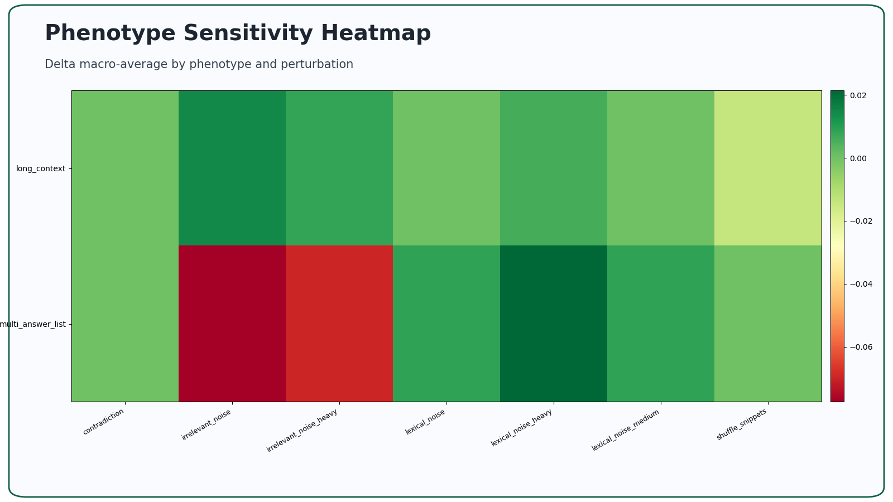
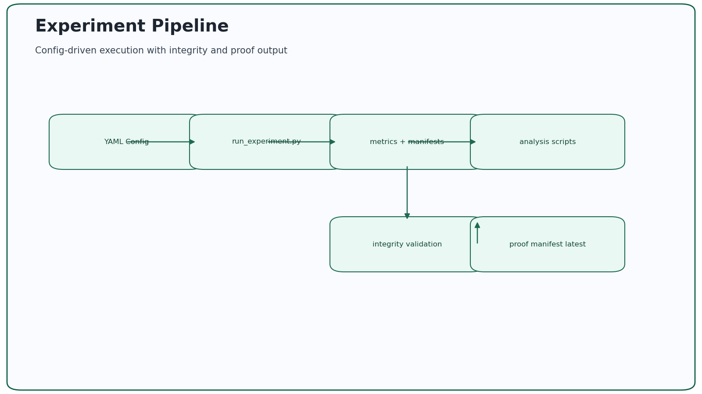

# BioLLM-Finetune

**BioLLM-Finetune** is a modular **LLM experimentation and evaluation infrastructure** for **Biomedical Question Answering (QA)**.

The repository originated as the primary codebase for a Master’s thesis in Data Science and has since evolved into a **general-purpose experimentation suite** supporting fine-tuning, inference, robustness testing, perturbation analysis, and phenotype-aware evaluation of open-weight Large Language Models.

In addition to the thesis experiments, this repository documents and implements a **complete robustness study** that demonstrates how the system can be used for controlled, reproducible experimentation beyond training.

---

## What This Proves For Hiring

For AI backend/platform and applied AI roles, this repository demonstrates:
- Building deterministic, config-driven evaluation systems rather than one-off scripts
- Producing auditable artifacts that support model behavior decisions
- Operating reproducible experiment pipelines with integrity checks and report generation

---

## Visual Proof

Claim: perturbation impact is ranked reproducibly across canonical runs.  
Evidence sources: `results/phase4/report_artifacts/tables/perturbation_ranking_macro_avg.csv`, `results/phase4/summary.json`

Claim: robustness behavior varies by phenotype and must be analyzed beyond global averages.  
Evidence source: `results/phase4/report_artifacts/tables/phenotype_delta_macro_avg.csv`

Claim: experiment integrity comes from config-driven execution plus explicit integrity validation.  
Evidence sources: `scripts/run_experiment.py`, `scripts/validate_experiment_integrity.py`, `proof/evidence_manifest.latest.json`

---

## 5-Minute Reviewer Path

1. Read this repository overview and capability summary.
2. Open the robustness outputs:
   - `results/phase4/summary.json`
   - `results/phase4/analysis/phase4_findings.md`
   - `results/phase4/report_artifacts/tables/perturbation_ranking_macro_avg.md`
3. Skim methodology context in:
   - `docs/experiment_design.md`
   - `docs/results_and_discussion.md`

---

## Evidence Artifacts / Outputs

- Phase summary: `results/phase4/summary.json`
- Robustness findings: `results/phase4/analysis/phase4_findings.md`
- Phenotype findings: `results/phase4/analysis/phenotype_findings.md`
- Ranking outputs: `results/phase4/analysis/perturbation_ranking.md`
- Report artifacts: `results/phase4/report_artifacts/tables/`

---

## Canonical Proof Bundle (Latest)

- Contract: `proof/evidence_contract.schema.json`
- Manifest: `proof/evidence_manifest.latest.json`
- Proof points: `proof/proof_points.latest.md`
- Validation command:
  - `python proof/validate_evidence_manifest.py`

---

## Overview

This project is intentionally designed as an **experiment-first research system**, not just a collection of training scripts.

It enables:
- Config-driven experiments
- Deterministic execution
- Clean vs perturbed comparisons
- Seed-controlled robustness analysis
- Phenotype-conditioned aggregation
- Reproducible reporting artifacts

All experiments are traceable, inspectable, and reproducible from configuration alone.

---

## Core Capabilities

- **Fine-tuning**  
  LoRA and QLoRA fine-tuning for instruction-style biomedical QA

- **Inference**  
  Deterministic, config-driven generation on CPU, MPS, or GPU

- **Evaluation**  
  BioASQ-style metrics including accuracy, F1, EM, and ROUGE

- **Perturbation**  
  Deterministic input corruption pipelines (lexical, contextual, logical)

- **Robustness Analysis**  
  Clean vs perturbed delta computation across seeds

- **Phenotype Analysis**  
  Linguistic and semantic phenotype tagging and aggregation

- **Integrity Validation**  
  Automated experiment consistency and sanity checks

- **Reporting**  
  Scripted generation of tables and figures for results sections

---

## Experimentation Infrastructure

Experiments are defined entirely through YAML configuration and executed in a controlled grid.

Each experiment produces a **self-contained artifact directory** containing:
- Exact inference inputs
- Model predictions
- Evaluation metrics
- Phenotype tags
- Run manifest and metadata

This design allows experiments to be inspected, validated, and extended long after execution.

---

## Repository Layout (Conceptual)

- archive  
  Historical local and server codebases retained for academic provenance

- configs  
  YAML configurations for fine-tuning, inference, and experiment grids

- data  
  Sample datasets and reproducible subsets

- src/biollm_finetune  
  Core Python package implementing training, inference, evaluation, and analysis

- scripts  
  Entry points for experiment execution, aggregation, validation, and reporting

- results  
  Generated experiment artifacts, aggregations, tables, and figures

---

## Phase 4: Robustness Experimentation

A full robustness study is implemented and documented in this repository.

Key characteristics:
- Inference-only (no fine-tuning)
- Deterministic perturbations
- Three fixed seeds for stability analysis
- Clean baselines matched per seed
- Phenotype-conditioned aggregation
- Automated integrity validation
- Scripted tables and figures for reporting

This phase demonstrates how the repository functions as an **LLM experimentation suite**, not just a training pipeline.

---

## Installation

Create a virtual environment and install in editable mode:

python -m venv .venv  
source .venv/bin/activate  
pip install -e .

Alternatively, install dependencies directly:

pip install -r requirements.txt

---

## Local macOS Execution (MPS / CPU)

The repository supports full local execution on Apple Silicon using the MPS backend.

Tiny configurations are provided for:
- End-to-end validation
- Smoke testing
- CI-friendly execution

These configurations are designed for correctness, not benchmarking.

---

## Reproducibility

All experiments are:
- Seed-controlled
- Deterministic
- Config-driven
- Fully logged

Sample datasets used for testing and smoke runs are generated via scripted sampling and stored under the data directory.

---

## License

Released under the MIT License.

---

## Citation

If you use this code or build upon it, please cite:

Christopher Anaya (2025)  
LLM Fine-Tuning With Biomedical Open-Source Data  
Master’s Thesis in Data Science  
Faculty of Science, University of Lisbon  
Repository: https://github.com/chranama/biollm-finetune

---

## Acknowledgments

This work builds on the BioASQ Challenge and open-source contributions from the biomedical NLP and Hugging Face communities.
